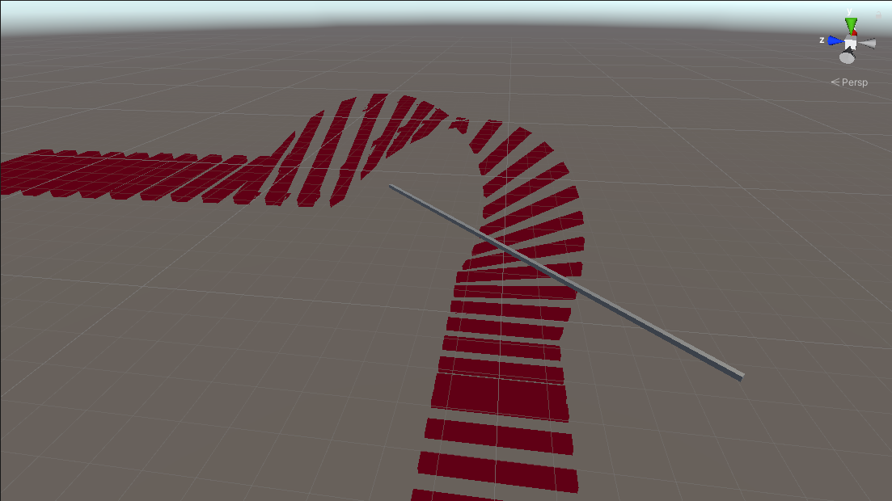
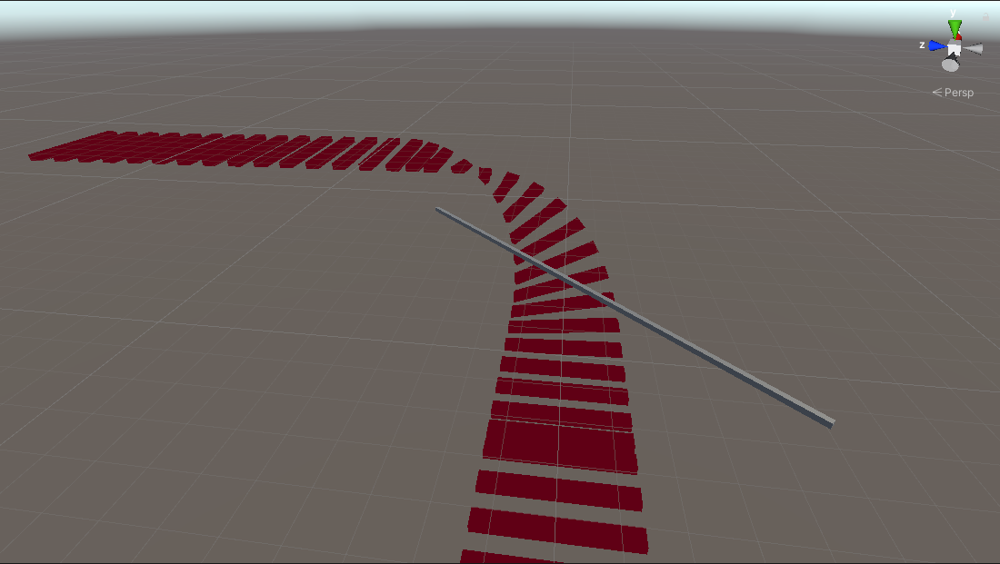

### Day four progress

- Added a cube to visualize the rotational axis and also can be used to move and rotate it.
- Fixed a bug which was making the rounded portion larger than it should be. Check bug 1 below.

#### Bugs

1. Fixed the `originOnPlane` variable, it was calculated wrong in the shader, it should alawys be perpendicular to our axis. The comparison after fixing is shown below:
 

### Screenshot

