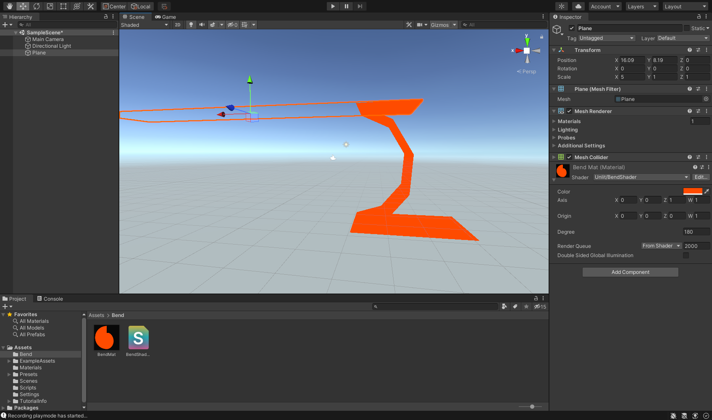
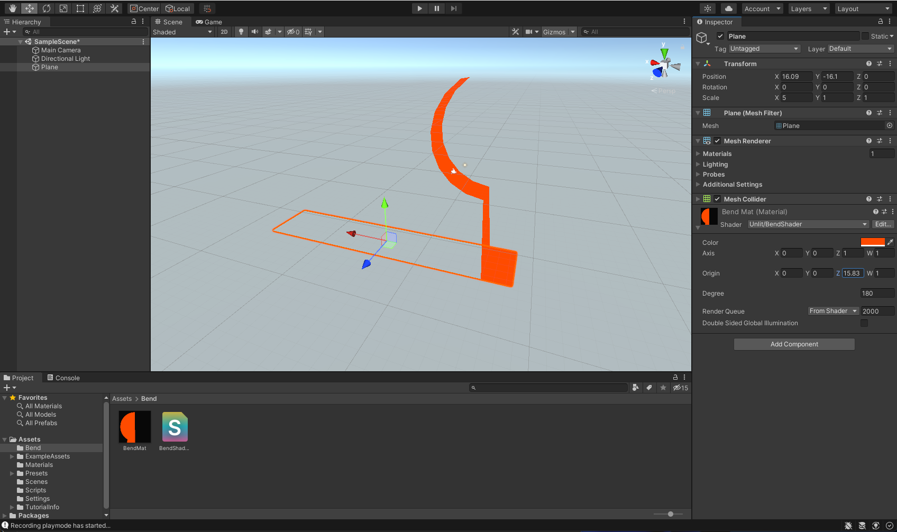
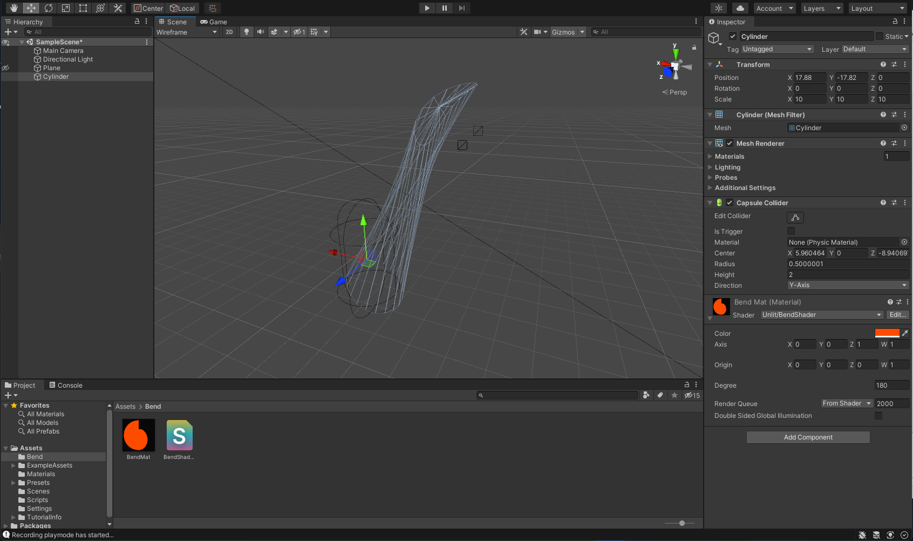
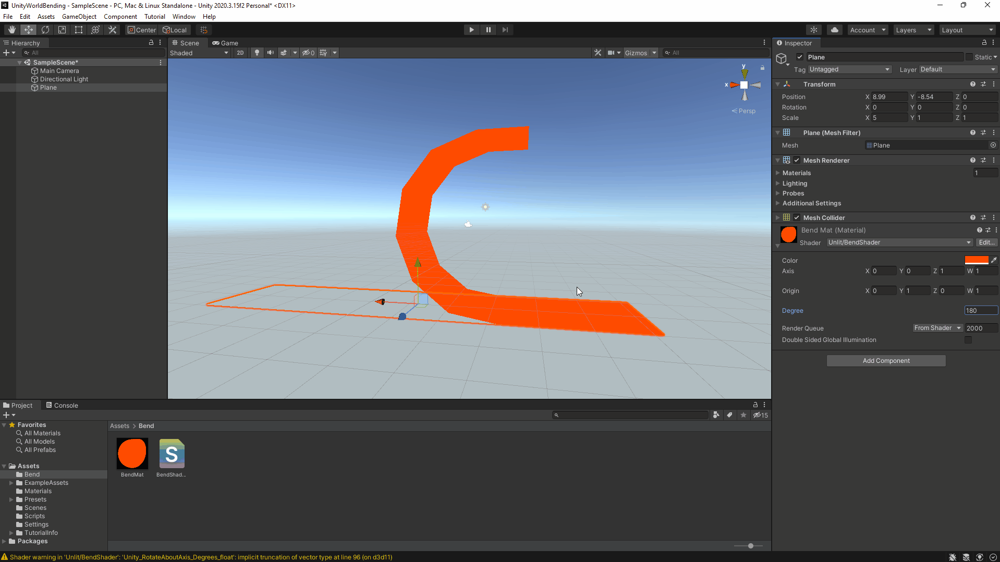

### Day One progress

- Added a basic bending algorithm to bend the geometries along the `z-axis` in positive `x` direction. Did this to break down the problem into a simpler one and get the feel of how the transformation will work. The current function allow moving the rotational axis along the `x` and `y` axis but only along the positive side.

### Bugs
- If the rotational axis is lower relative to the geometry then the curve direction is reversed. 
- While the rotational axis is along the `z-axis`, moving the `origin` along the same axis should not affec the geometry. 
- Connected geometries are distorting due to different rotation at different points, they should probably be rotated relative to their local origin and then rotated around the rotational axis. 

### Screenshot

