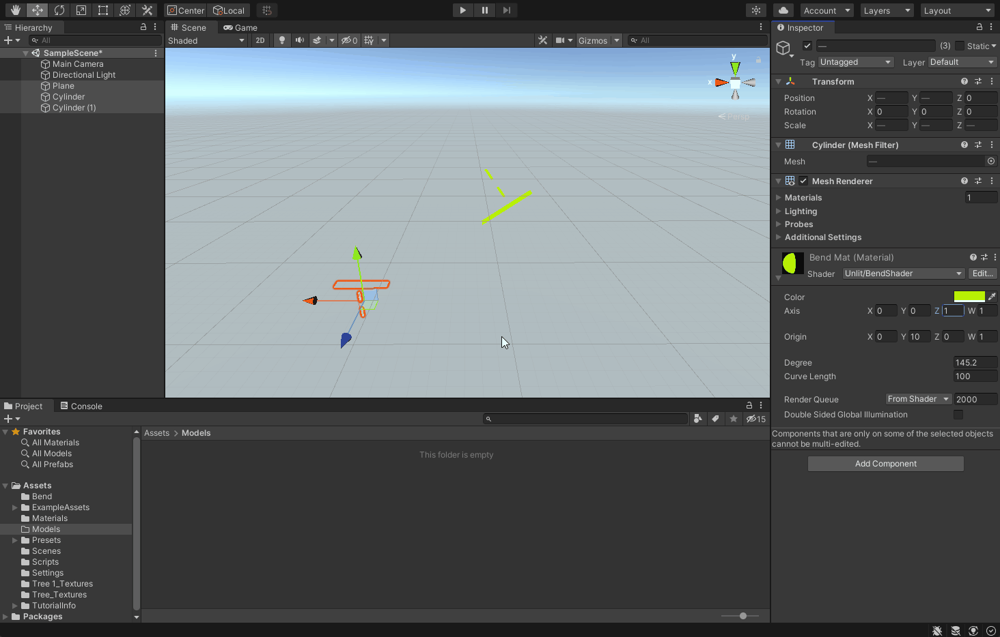

### Day two progress

##### Morning
- Fixed bug 1 from . The direction of rotation is now calculated using the relative direction from axis.
- Fixed bug 3 from . The distortion in the geometries was because the rotation around the axis was dependent on the distance from axis, which is incorrect. The rotation must be same regardless of the distance from the axis to avoid the distortion. 
- Renamed to `Bend` function to `BendZ` because it only bend along the `z-axis`. The next step is to first fix bug 2 from , and then work on rotating the geometries along any arbitary axis.

##### Evening

- Nothing.

### Screenshot

